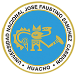

<p align="center">
  <a href="https://github.com/martii-n/system-ppp-unjfsc">
    
  </a>
</p>

<h1 align="center">Sistema de Gestión de Prácticas Pre-Profesionales (UNJFSC)</h1>

<p align="center">
  ¡Bienvenido al repositorio oficial del Sistema de Gestión de Prácticas Pre-Profesionales para la Universidad Nacional José Faustino Sánchez Carrión! Este sistema está diseñado bajo una arquitectura robusta, modular y de alto rendimiento utilizando un stack moderno full-stack.
</p>

### Stack Tecnológico

* **Backend:** Laravel (PHP)  
* **Frontend:** React + Inertia.js 
* **Estilos y UI:** Tailwind CSS + Shadcn UI 
* **Base de Datos:** MariaDB 
* **Entorno y Despliegue:** Docker & Docker Compose
* **Seguridad:** Cloudflare Proxy / Tunnels (Producción)

---

### Estructura Principal del Proyecto

```text
├── app/                  # Lógica del Backend (Controladores, Modelos, Middleware)
├── bootstrap/            # Configuración de inicialización de Laravel
├── config/               # Archivos de configuración del framework
├── database/             # Migraciones, Factories y Seeders (MariaDB)
├── docker/               # Archivos de configuración de entornos Docker (Nginx, PHP, etc.)
├── resources/
│   ├── js/               # Frontend en React + Inertia.js
│   │   ├── Components/   # Componentes reutilizables (Shadcn UI)
│   │   ├── Pages/        # Vistas y Páginas de la aplicación
│   │   └── app.jsx       # Punto de entrada de React
│   └── views/            # Plantilla raíz (root.blade.php)
├── routes/               # Rutas de la Aplicación (web.php, api.php)
├── docker-compose.yml    # Orquestación de contenedores (Dev/Prod)
└── vite.config.js        # Configuración del empaquetador Vite
```
---

### 1. Modo Desarrollo (Local - Híbrido)

En el entorno de desarrollo, la base de datos corre aislada en un contenedor Docker, mientras que Laravel y React se ejecutan de forma nativa en tu máquina local para facilitar una depuración rápida y aprovechar el *hot-reload*.

### Prerrequisitos
Asegúrate de tener instalado en tu sistema local:
* Docker & Docker Compose
* PHP 8.4+ & Composer
* Node.js (v18+ recomendado) & NPM

#### Pasos para Inicializar en Local

1. **Clonar el repositorio (rama por defecto/main):**
   ```bash
   git clone https://github.com/martii-n/system-ppp-unjfsc.git
   cd system-ppp-unjfsc
2. **Configurar el archivo de entorno local**
    ```bash
    cp .env.example .env
    ```
    Nota crítica: Abre tu .env y configura DB_PORT=3307 para conectar correctamente con el mapeo del contenedor externo de desarrollo.
3. **Instalar dependencias del backend e iniciar la Base de Datos**
    ```bash
    # Instalar paquetes de Composer locales
    composer install
    
    # Generar la clave única de la aplicación
    php artisan key:generate
    
    # Levantar el contenedor de MariaDB en segundo plano
    docker compose --profile dev up -d
    ```
4. **Ejecutar Migraciones y Poblado de Datos (Seeds)**
    ```bash
    php artisan migrate --seed
    ```
    Nota: Si el comando falla indicando que busca el puerto 3306, limpia la caché de configuración con **php artisan config:clear** o fuerza el puerto ejecutando: DB_PORT=3307 **php artisan migrate --seed**.
5. **Instalar dependencias del frontend**
    ```bash
    npm install
    ```
6. **Ejecución del Entorno de Desarrollo**
    Para comenzar a trabajar, necesitas levantar tanto el servidor de PHP como el compilador de Vite. Ejecuta los siguientes comandos (se recomienda usar pestañas de terminal separadas):
    ```bash
    composer run dev
    ```

    http://localhost:8000

---

### 2. Modo Producción (VPS + Docker Completo)
El entorno de producción corre de forma 100% contenerizada dentro del VPS. Todo el tráfico web externo está completamente blindado y anonimizado utilizando Cloudflare Tunnels, eliminando la necesidad de exponer puertos públicos del servidor al internet.

### Prerrequisitos en el VPS
* Docker & Docker Compose instalado de forma nativa.
* Cuenta de Cloudflare con los Nameservers delegados correctamente.

#### Pasos para Inicializar en Local

1. **Clonar la rama de producción directamente en el VPS**
    ```bash
    git clone -b production https://github.com/martii-n/system-ppp-unjfsc.git
    cd system-ppp-unjfsc
    ```
2. **Configurar el entorno de producción**
    ```bash
    cp .env.example .env
    nano .env
    ```
    Asegúrate de definir variables seguras para la base de datos de producción (db_system_ppp_prod).
3. **Levantar todo el Stack Productivo**
    Levanta de forma aislada los contenedores de producción (nginx, app-prod, db-prod) limitando sus recursos para proteger la RAM del VPS:
    ```bash
    docker compose --profile prod up -d
4. **Ejecutar Migraciones Estructurales**
    Corre las migraciones de forma interna y segura dentro del contenedor productivo app:
    ```bash
    docker exec -it app-prod php artisan migrate --force
    ```
5. **Optimizar el Rendimiento de Laravel**
    Obliga a Laravel a precargar las configuraciones, rutas y layouts en memoria para acelerar la velocidad de carga de las peticiones de Inertia:
    ```bash
    docker exec -it app-prod php artisan optimize
    ```
    El sistema estará listo y securizado, respondiendo directamente de forma cifra a través de 
    https://sistemappp.kerpun.com

## Licencia

Este proyecto está bajo la licencia **Attribution-NonCommercial-NoDerivatives 4.0 International (CC BY-NC-ND 4.0)**.

A efectos prácticos, esto significa que:
* **Permitido:** Puedes ver, descargar, estudiar y compartir el código con fines académicos y de aprendizaje.
* **Atribución:** Se debe dar el crédito correspondiente de manera adecuada, proporcionando un enlace a este repositorio.
* **No Comercial:** No puedes utilizar este proyecto, su código o sus componentes para fines comerciales o lucrativos.
* **Sin Derivadas:** Si remezclas, transformas o creas a partir de este material, no puedes distribuir el material modificado.

Para más detalles, puedes revisar el archivo [LICENSE](LICENSE) o visitar [Creative Commons](https://creativecommons.org/licenses/by-nc-nd/4.0/deed.es).
